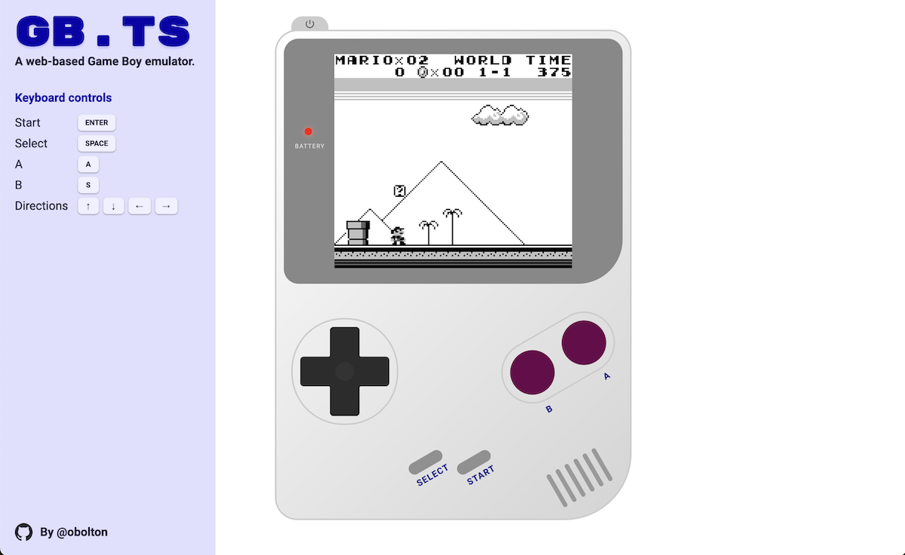

# gb.ts

A web-based Game Boy emulator, written in TypeScript.

**[Live demo](https://oliverbolton.com/gb.ts/)**



## Supported features

- Graphics
- Audio
- Timing
- Keyboard input
- MBC types:
  - MBC 1
  - MBC 2
  - MBC 3 (partial)
  - MBC 5

## Browser support

Tested in:

- Chrome 117.0+
- macOS Safari 17.0+
- iOS Safari 17.0+

## Development

### Requirements

- NPM

### Starting the development server

Run the following command:

```sh
npm start
```

Then open the local/network URL displayed in your web browser.

### Production build

To build a static version:

```sh
npm run build
```

Built files are placed in `public/`.

## Helpful resources

- [Pan Docs](https://gbdev.io/pandocs/), a comprehensive technical reference for Game Boy development
- [Game Boy instruction set](https://gbdev.io/gb-opcodes/optables/)
- [Game Boy hardware test ROMs](https://github.com/retrio/gb-test-roms)
- [dmg-acid2](https://github.com/mattcurrie/dmg-acid2) PPU verification test

This project is not affiliated in any way with Nintendo. Game Boy is a registered trademark of Nintendo Co., Ltd.
